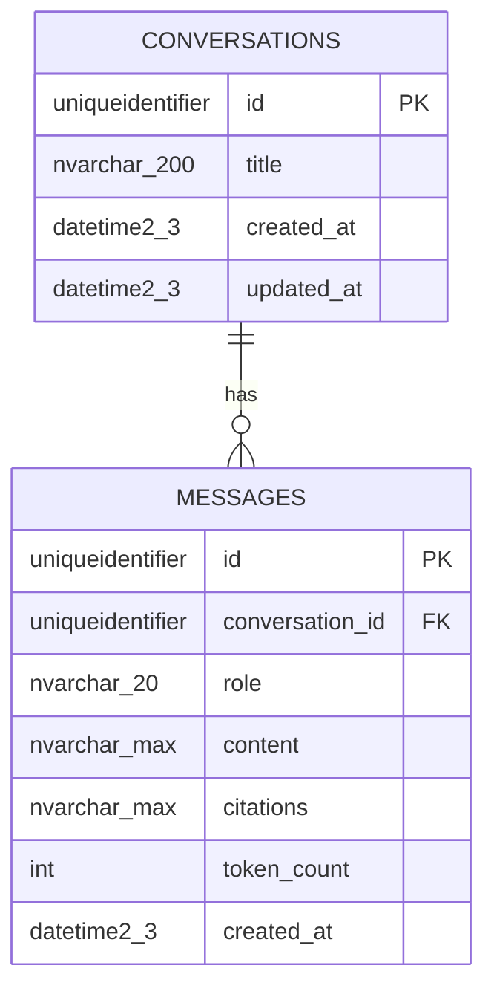

# Database design — project database

_The project's **own** Azure SQL Database (created by the use-case Bicep deployment before any model work — root
`CLAUDE.md` → "What you cannot do"; there is no local database). External databases go in
[`external-systems.md`](external-systems.md), not here._

## Overview

- **Azure resource:** **dev is pre-created** (reached through `DATABASE_URL` in `apps/api/.env`; first release runs
  locally — `ARCHITECTURE.md` B6). When the use-case Bicep deploys: server `sql-team-assistant-<env>` · database
  `sqldb-team-assistant-<env>` (`infra/modules/sql-database.bicep` via `infra/main.bicep`)
- **Access from `apps/api`:** read/write via `DATABASE_URL` (Key Vault secret `DATABASE-URL`;
  managed identity when deployed)
- **Service tier / SKU:** dev — the pre-created database's; staging `S0` · prod `S1` (`main.<env>.bicepparam`)
- **Conventions:** UUID primary keys (`UNIQUEIDENTIFIER`), `created_at`/`updated_at` with server
  defaults, snake_case table/column names, a length on every string column, constraints named by
  the template's naming convention (`app/db/base.py`)

## Entity diagram

## Tables

### `conversations`

| Column       | Type               | Null | Default                                  | Notes                                                       |
| ------------ | ------------------ | ---- | ---------------------------------------- | ----------------------------------------------------------- |
| `id`         | `uniqueidentifier` | no   | generated                                | PK                                                          |
| `title`      | `nvarchar(200)`    | no   | the given title, else "New conversation" | the first question (cut to 200) replaces "New conversation" |
| `created_at` | `datetime2(3)`     | no   | server default                           |                                                             |
| `updated_at` | `datetime2(3)`     | no   | server default                           | bumped on every new message (list is newest first)          |

- **Indexes:** PK only
- **Foreign keys:** none
- **PII / retention:** free-text title derived from a user question; kept indefinitely (B8 #5); shared — no owner until auth lands (B7)
- **Expected volume:** _(not stated — internal team use)_

### `messages`

| Column            | Type               | Null | Default        | Notes                                                                            |
| ----------------- | ------------------ | ---- | -------------- | -------------------------------------------------------------------------------- |
| `id`              | `uniqueidentifier` | no   | generated      | PK                                                                               |
| `conversation_id` | `uniqueidentifier` | no   | —              | FK → `conversations.id` (`NO ACTION`)                                            |
| `role`            | `nvarchar(20)`     | no   | —              | named `CHECK (role IN ('user','assistant'))`                                     |
| `content`         | `nvarchar(max)`    | no   | —              | user question ≤ 4,000 characters (API limit)                                     |
| `citations`       | `nvarchar(max)`    | yes  | —              | JSON `[{title, path}]`, named `CHECK (citations IS NULL OR ISJSON(citations)=1)` |
| `token_count`     | `int`              | yes  | —              |                                                                                  |
| `created_at`      | `datetime2(3)`     | no   | server default |                                                                                  |

- **Indexes:** `(conversation_id, created_at)` — serves the "last 10 messages" history query and the thread load
- **Foreign keys:** `conversation_id` → `conversations.id`, `ON DELETE NO ACTION` (delete is out of scope, B8 #6)
- **PII / retention:** free-text questions and answers; kept indefinitely, no purge job (B8 #5); never logged or put in telemetry (B3)
- **Expected volume:** _(not stated — internal team use)_

## Migration notes

- **`3f1c2a9b7d10` — create conversations and messages** (`apps/api/alembic/versions/`): both
  tables, the named CHECKs, the FK and the `(conversation_id, created_at)` index. Hand-written (the
  dev database was not reachable for autogenerate); `tests/test_models_conversation.py` checks it
  renders exactly the model DDL. **Applied to the dev database** by Maged Hazem on 2026-10-06
  (`alembic upgrade head`); `alembic check` against dev reports no drift.
- `downgrade()` drops both tables (all chat history) — run only with explicit confirmation.
- Nothing outside Alembic: no seed data, no extra roles. Timestamps are `datetime2(3)` UTC
  (`SYSUTCDATETIME()`), chosen in B4 over rule 25's `DateTime(timezone=True)` preference.
